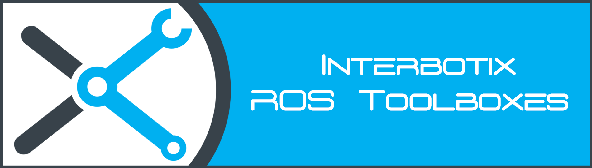
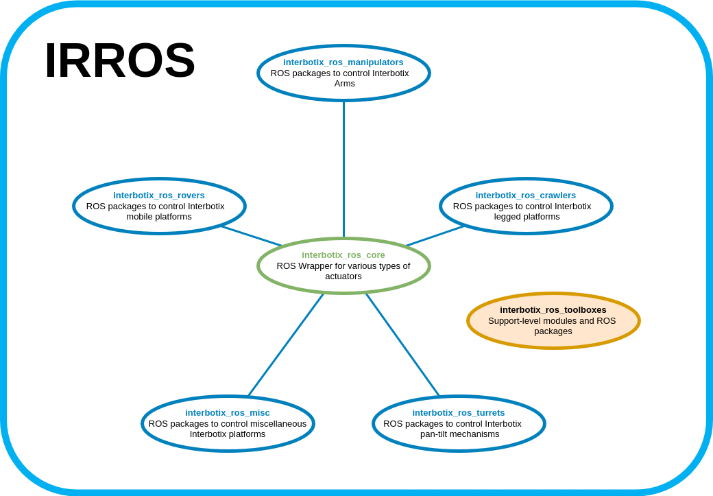

## Overview

Welcome to the *interbotix_ros_toolboxes* repository! This repo contains support level ROS wrappers or Python modules that are used in many of our robotic platforms at [Interbotix](https://www.trossenrobotics.com/).

Links to other repositories that use this repo include:
- [interbotix_ros_turrets](https://github.com/Interbotix/interbotix_ros_turrets)
- [interbotix_ros_rovers](https://github.com/Interbotix/interbotix_ros_rovers)
- [interbotix_ros_crawlers](https://github.com/Interbotix/interbotix_ros_crawlers)
- [interbotix_ros_manipulators](https://github.com/Interbotix/interbotix_ros_manipulators)

## Repo Structure
```
GitHub Landing Page: Explains repository structure and contains a single directory for each type of toolbox.
├── Toolbox Type X Landing Page: Contains support-level ROS packages for a given actuator/hardware platform.
│   ├── Support-Level Toolbox ROS Package 1
│   ├── Support-Level Toolbox ROS Package 2
│   └── Support-Level Toolbox ROS Package 3
│       ├── Robot Python Module Type 1
│       ├── Robot Python Module Type 2
│       └── Robot Python Module Type X
├── LICENSE
└── README.md
```
As shown above, there are four main levels to this repository. To clarify some of the terms above, refer to the descriptions below.

- **Toolbox Type** - Toolboxes are broken up into types based on hardware or application. For example, one toolbox exists for Dynamixel-based robot platforms. Similarly, another toolbox exists for the Raspberry Pi platform. The Common toolbox on the other hand can be used for any application, regardless of hardware type. Future toolboxes could be based on other types of actuators or other computer platforms (like the Nvidia Jetson).

- **Suppport-Level Toolbox ROS Package** - This refers to a ROS package that is used for more than one Robot Type (like for manipulators and rovers). By putting the package here, there's only instance of the code instead of duplicates in multiple repositories. Some examples include the *interbotix_xs_ros_control* and *interbotix_moveit_interface* ROS packages as they are used both in the *interbotix_ros_manipulators* and *interbotix_ros_rovers* repositories.

- **Robot Python Module** - This refers to a Python Module found in the *interbotix_XXXXX_modules* ROS package. These modules are here because they can also be used for more than one robot type. For example, the *arm.py* module in the *interbotix_xs_modules* ROS package can be used both in X-Series Locobots found in the *interbotix_ros_rovers* repository and in the X-Series Arms found in the *interbotix_ros_manipulators* repository.

## Contributing
Feel free to send PRs to add features to currently existing Toolbox ROS packages or to include new ones (like modules). Note that all PRs should follow the structure and naming conventions outlined in the repo including documentation.

## Contributors
- [Solomon Wiznitzer](https://github.com/swiz23) - **ROS Engineer**
