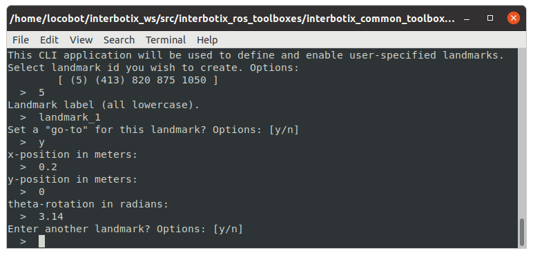

# interbotix_landmark_modules

## Overview
This package contains Python modules and scripts, and supporting level ROS nodes to perform tasks using the AprilTag fiducals as landmarks. Using the landmarks along with a camera, it is possible denote items of interest in a space. This package is built on top of the [apriltag module](../../interbotix_perception_toolbox/interbotix_perception_modules/src/interbotix_perception_modules/apriltag.py) from the [interbotix_perception_modules package](../../interbotix_perception_toolbox/interbotix_perception_modules).

Landmarks are defined using a simple configuration file (example [here](landmarks/landmarks.yaml)). The file format is as follows:
- **landmark:** - Key for the landmark. Set as the AprilTag ID it represents
    - **mounted:** - True if the tag that defines the landmark is mounted to a wall
        - **offset:** - How far from the mounted tag the robot should go to when set as the nav goal.
    - **id:** - AprilTag ID of the landmark
    - **label:** - Name given to the landmark
    - **set:** - Whether or not the AprilTag has been detected. False by default. *Do not set this manually*.

## Structure
Below is a list and short description of each helper module. Over time, this list will grow to include others.

- [landmark](src/interbotix_landmark_modules/landmark.py) - This file contains the Landmark and LandmarkCollection object definitions. Landmark is a module used to store data about landmarks, calculate transforms, and manage landmark pose in the world and the TF tree. The LandmarkCollection module is a higher level object that contains useful helper functions to manage the collection of landmarks.

Below if a list and short description of each helper node. Over time, this list will grow to include others.

- **landmark_manager** - Presents a command line application to define landmarks. The manager requests an AprilTag ID out of the list of tags specified in the launch file, a label for the landmark, whether the tag is mounted, and the mounted offset. Once the user is finished entering landmarks, the application will close, and the landmarks will be saved to the specified file.

  

- **landmark_finder** - Node that uses the AprilTag **single_image_server_node** to periodically take snapshots from a camera. If a landmark is detected by this node, a transform to its pose is published to the static TF tree.

- **tf_map_to_landmark** - Small node that publishes a transform between a fixed frame and the origin frame (usually map) to separate the landmarks from other frames on the TF tree.

## Usage
To use any module, simply include the appropriate launch file in the [launch](launch/) directory in you master launch file. Then make sure to include the appropriate import statement in your Python script as described above.

### Launch File Arguments
Short descriptions for each launch file's arguments are below...

#### landmark_manager.launch
| Argument | Description | Default Value |
| -------- | ----------- | :-----------: |
| landmark_config | location of the landmark.yaml configuration file | [landmarks/landmarks.yaml](landmarks/landmarks.yaml) |
| fixed_frame | frame that landmark TFs will be transformed to once observed | landmarks |
| obs_frame | frame from which landmarks will be observed from | camera_color_optical_frame |
| standalone_tags | individual AprilTags the algorithm should be looking for | refer to [landmark_manager.launch](launch/landmark_manager.launch) |

## Troubleshooting

### Landmark Issues

##### File at \<filepath\> does not exist yet. No landmarks loaded.
Tried to load landmarks from a file that doesn't exist. Make sure that you're pointing to the right file and that your yaml file is properly formatted.

<!-- ##### Tried to publish goto marker but node is not active.
Tried to publish a visual representation of the goto markers, but the landmark has not yet been found. Make sure to detect the landmark using the **landmark_finder** before trying to publish any information about the transformation or the goto. -->

## Future Work
- Add special landmark labels that, when navigated to, trigger some function.
    - For example, navigating to a landmark labeled `dock` triggers an automated docking sequence.
