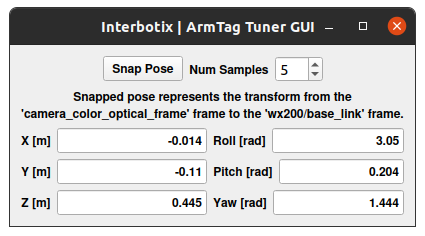
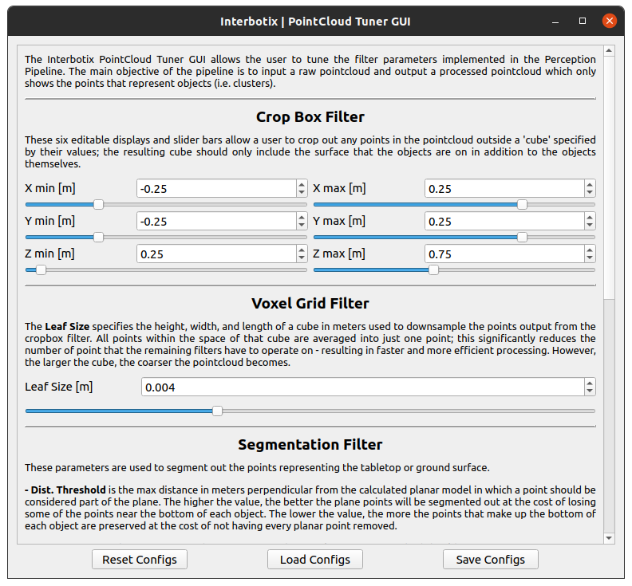

# interbotix_perception_modules

## Overview
This package contains Python modules along with supporting level ROS nodes to perform perception with any robotic arm platform. Using the tools here along with a color/depth camera, robotic arm, and AprilTag, it is possible to have the arm pick and place small objects from a tabletop-type platform using camera feedback. Examples showcasing this can be found in the *interbotix_XXXXX_perception* ROS package in any arm-related repository.

## Structure
Below is a list and short description of each helper module. Over time, this list will grow to include others.

- [apriltag](src/interbotix_perception_modules/apriltag.py) - small API to interact with AprilTag's **apriltag_ros_single_image_server_node** node; it allows users to snap a picture of an AprilTag and returns its pose relative to the camera frame. Note that the module is only meant to be used to capture static AR tags or to find a static transform with the help of the tag. For AR tag tracking, the **apriltag_ros_continuous_node** should be used. No module exists for that yet. To import, include `from interbotix_perception_modules.apriltag import InterbotixAprilTagInterface` in your Python script.

  - `camera_info_topic` - ROS parameter that specifies the absolute topic name where the camera calibration info is published
  - `camera_color_topic` - ROS parameter that specifies the absolute topic name where the camera color images are published

- [armtag](src/interbotix_perception_modules/armtag.py) - small API that builds upon the **apriltag** module; it calculates a static transform (usually from the camera's frame to an arm's base_link frame) using the help of an AprilTag located on the arm (at a location specified in the URDF). To import, include `from interbotix_perception_modules.armtag import InterbotixArmTagInterface` in your Python script.

  - `arm_tag_frame` - ROS parameter that specifies the name of the link (usually in the URDF) on the arm where the AR tag is located
  - `ref_frame` - ROS parameter that specifies the 'parent' frame of the static transform you'd like to publish using the help of the AprilTag
  - `arm_base_frame` - ROS parameter that specifies the 'child' frame of the static transform you'd like to publish using the help of the AprilTag

- [pointcloud](src/interbotix_perception_modules/pointcloud.py) - small API that can be used to tune various filter parameters used in the Perception Pipeline. To import, include `from interbotix_perception_modules.pointcloud import InterbotixPointCloudInterface` in your Python script.

  - `filter_params` - ROS parameter that specifies the filepath to a YAML file where all the filter settings are stored

Below is a list and short description of each helper node. Over time, this list will grow to include others.

- **armtag_tuner_gui** - presents a PyQt GUI to the user with a 'snap' button that can be used to find an AprilTag and publish the desired static transform; it also shows the resulting transform to the user

- **picture_snapper** - small node that presents a 'snap_picture' ROS Server; it saves the latest picture obtained from a camera to the specified file location; it's important for this node to run on the same computer that the **apriltag_ros_single_image_server_node** node is running on since the latter node needs to be able to access the image file.

- **static_trans_pub** - this is a small custom node that manages static transforms; any module that would like to publish a static transform publishes it to this node; it then appends it to a list if its a new transform or modifies a current transform and sends it out to ROS; it also loads/saves the transforms to a YAML file at node startup/shutdown

- **pointcloud_tuner_gui** - presents a PyQt GUI to the user with display boxes and slider bars to allow a user to tune filter parameters used in the perception pipeline; it also loads/saves these settings to a YAML file

- **perception_pipeline** - implements the Perception Pipeline using the [PointCloud Library](http://wiki.ros.org/perception_pcl)

## Usage
To use any module, simply include the appropriate launch file in the [launch](launch/) directory to your master launch file. Then make sure to include the appropriate import statement in your Python script as described above.

### GUI Options

There are two GUIs in this package. The first GUI - the *Armtag Tuner GUI* can be used to snap an AprilTag pose and publish a static transform using it. The second GUI - the *PointCloud Tuner GUI* can be used to adjust filter parameters used in the [Perception Pipeline](https://industrial-training-master.readthedocs.io/en/melodic/_source/session5/Building-a-Perception-Pipeline.html). See descriptions about each part of these GUIs below. Note that the order in which the the bullet points appear is the order that a user should operate the GUI.

  

- **Num Samples** - this adjusts from a value of 1 to 10 in integer increments; it tells the backend how many samples it should take of the AprilTag before averaging them together to get a more accurate pose
- **Snap Pose** - by pressing this button, the AprilTag algorithm is run **Num Samples** times; the description below the button tells you what the transform represents; the resulting average of these transform is then sent over to the **static_trans_pub** node to be eventually included in the `/tf_static` tree
- **Displays** - the six non-editable fields below the transform description let the user know what the actual transform is

The next GUI shows the filters implemented in the Perception Pipeline in the order that they are used. The main objective of the pipeline is to input a raw pointcloud and output a processed pointcloud which only shows the points that represent objects (i.e. clusters).

  

- **CropBox Filter Settings** - these six editable displays and slider bars allow a user to crop out any points in the pointcloud outside a 'cube' specified by their values; the resulting cube should only include the surface that the objects are on in addition to the objects themselves.

- **Voxel Grid Setting** - the leaf size specifies the height, width, and length of a cube used to downsample the points output from the cropbox filter. All points within the space of that cube are averaged into just one point; this significantly reduces the number of point that the remaining filters have to operate on - resulting in faster and more efficient processing. However, the larger the cube, the coarser the pointcloud becomes...

- **Segmentation Filter Settings** - these are parameters used to segment out the points representing the tabletop or ground surface; *Max Iterations* is the maximum number of iterations the sample consensus method should run (not sure, but I believe the higher the value, the more accurate the planar model representing the points is); the default value is 50 and that seems to work just fine; *Dist Thresh* is the max distance perpendicular from the calculated planar model in which a point should be considered part of the plane; the higher the value, the better the plane poitns will be segmented out at the cost of losing some of the points near the bottom of each object; the lower the value, the more the points that make up the bottom of each object are preserved at the cost of not having every planar point removed...

- **Radius Outlier Removal Settings** - these are parameters to reduce the number of 'noisy' points that have still made it through the filters above; *Radius Search* is the radial distance around any given point in the pointcloud where neighboring points should be searched. If a point has at least 'X' *Min Neighbors* in the search radius, the point is kept; otherwise, it is thrown out.

- **Cluster Settings** - these are parameters used to determine what's considered an acceptable cluster. *Cluster Tol* is a thresholding parameter that says any point within a specified distance from another point should be treated as a single cluster; *Cluster Min Size* specifies that any cluster must be made up of at least 'Y' many points to be considered a cluster; similarly, *Cluster Max Size* specifies that any cluster with more than 'Z' many points should no longer be considered a cluster.

- **Load Configs** - this allows a user to specify a file from which to load a set of desired filter parameters.

- **Save configs** - this allows a user to specify a file to which to save the current settings.

- **Reset Configs** - this allows a user to reset the current settings to be what they were when the file was originally loaded into the GUI.

### Launch File Arguments
Short descriptions for each launch file's arguments are below...

#### apriltag.launch
| Argument | Description | Default Value |
| -------- | ----------- | :-----------: |
| tag_family | family to which the AprilTag belongs | tagStandard41h12 |
| standalone_tags | individual AprilTags the algorithm should be looking for | refer to [tags.yaml](config/tags.yaml) |
| camera_frame | the camera frame in which the AprilTag will be detected | camera_color_optical_frame |
| apriltag_ns | name-space where the AprilTag related nodes and parameters are located | apriltag |
| camera_color_topic | the absolute ROS topic name to subscribe to color images | camera/color/image_raw |
| camera_info_topic | the absolute ROS topic name to subscribe to the camera color info | camera/color/camera_info |

#### armtag.launch

Besides for the arguments listed below, the arguments above are in this launch file as well...

| Argument | Description | Default Value |
| -------- | ----------- | :-----------: |
| armtag_ns | name-space where the Armtag related nodes and parameters are located | armtag |
| ref_frame | the reference frame that the armtag node should use when publishing a static transform for where the arm is relative to the camera | $(arg camera_frame) |
| arm_base_frame | the child frame that the armtag node should use when publishing a static transform for where the arm is relative to the camera | base_link |
| arm_tag_frame | name of the frame on the arm where the AprilTag is located (defined in the URDF usually) | ar_tag_link |
| use_armtag_tuner_gui | whether to show a GUI that a user can use to publish the 'ref_frame' to 'arm_base_frame' transform | false |
| position_only | whether only the position component of the detected AprilTag pose should be used when calculating the 'ref_frame' to 'arm_base_frame' transform; this should only be set to true if a tf chain already exists connecting the camera and arm base_link frame, and you just want to use the AprilTag to refine the pose further | false |

#### pc_filter.launch
| Argument | Description | Default Value |
| -------- | ----------- | :-----------: |
| filter_ns | name-space where the pointcloud related nodes and parameters are located | pc_filter |
| filter_params | file location of the parameters used to tune the perception pipeline filters | "" |
| use_pointcloud_tuner_gui | whether to show a GUI that a user can use to tune filter parameters | false |
| enable_pipeline | whether to enable the perception pipeline filters to run continuously; to save computer processing power, this should be set to False unless you are actively trying to tune the filter parameters; if False, the pipeline will only run if the `get_cluster_positions` ROS service is called | $(arg use_pointcloud_tuner_gui) |
| cloud_topic | the absolute ROS topic name to subscribe to raw pointcloud data | /camera/depth/color/points |

#### static_transform_pub.launch
| Argument | Description | Default Value |
| -------- | ----------- | :-----------: |
| load_transforms | whether or not the **static_trans_pub** node should publish any poses stored in the static_transforms.yaml file at startup; this should only be set to false if a tf chain already exists connecting the camera and arm base_link frame (usually defined in a URDF), and you'd rather use that tf chain as opposed to the one specified in the static_transforms.yaml file | true |
| transform_filepath | filepath to the static_transforms.yaml file used by the **static_trans_pub** node; if the file does not exist yet, this is where you'd like the file to be generated | "" |

## Troubleshooting

Below are some error messages, warnings, or issues you might see, and how to go about fixing them.

### ArmTag Issues

##### Could not find AR Tag. Returning a 'zero' Pose...
This warning occurs if the camera cannot see the AprilTag or if the wrong AprilTag is present. To fix, make sure that the AprilTag is clearly visible to the camera when you try to 'snap' its pose.

### PointCloud Filter Tuning Issues

##### Incomplete bulk usb transfer!
This is just a onetime error message that appears at launch when using the SR305 camera. It's nothing to be worried about and can be safely ignored.

##### No stream match for pointcloud chosen texture Process - Color
This is a warning that can appear occasionally (once every 5 minutes or so) when using a RealSense camera. It just means that a frame was dropped during serial communication, but it's nothing to worry about and can be safely ignored.

##### No clusters found...
This warning is outputted by the `get_cluster_positions` function in the InterbotixPointCloudInterface module if the algorithm could not find any clusters. Verify that you have non-reflective objects within the field of view of the camera and that the CropBox filter is not cutting them out. To check this, toggle on the 'FilteredPointCloud' display in Rviz and see if the pointcloud representation of your objects are showing up. If they are, it's possible that you need to lower the minimum cluster size threshold; turn on the 'ObjectPointCloud' and 'ObjectMarkers' displays and lower the Min Cluster Size parameter until you see small spheres at the centroid of each of your clusters.

##### Found 'x' clusters instead of 'y' clusters...
This warning is outputted by the 'get_cluster_positions' function in the InterbotixPointCloudInterface module if the algorithm found a different number of clusters over 'num_samples' iterations (when compared to the first set of cluster positions received). Similar to the 'No clusters found...' issue, this can be resolved by tuning the Min Cluster Size parameter until the spherical object markers are steady and not flickering. This issue could also arise if the spherical object markers are flickering due to two clusters being very near each other (sometimes above or below the Cluster Tolerance threshold). To fix this, lower the cluster tolerance threshold or physically move the two objects such that they are further away from each other.

##### Could not match the cluster. Please tune the filter parameters such that all spherical 'object markers' are constant in their respective clusters and do not flicker
Most likely, you'll never run into this issue; but if you do, the fixes suggested in the 'Found x clusters instead of y clusters...' issue should resolve the problem. The issue essentially means that the detected position of a cluster in a later iteration is vastly different than the detected position of the cluster in an earlier iteration (over 'num_samples' iterations). It could arise if the Object Markers are flickering, and it just happens that the same number number of clusters are found, but the clusters are in different places. If working with an arm on a Locobot, another fix is to give time (half a second or so) for the arm to settle before capturing the pointcloud data. This is because the motion of the arm can cause the Kobuki base to wobble a bit - making the camera move as well.
