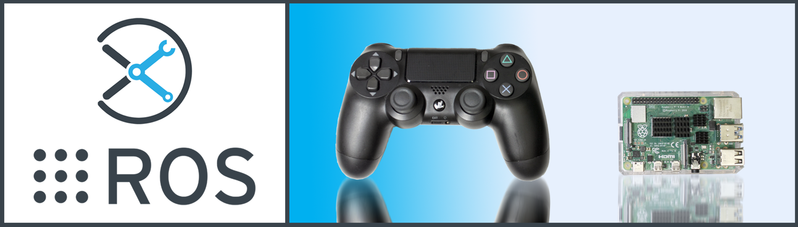

# Raspberry Pi 4B Setup

This tutorial will walk you through how to get Ubuntu Linux and ROS working on a Raspberry Pi 4B from scratch. Specifically, it explains how the microSD card image found on any Interbotix robot sporting a RPi4 was created. By way of introduction, many types of operating systems exist for the Pi. This includes Ubuntu, Debian, and Raspbian. However, in order to get optimal compatibility with ROS, Ubuntu is really the way to go. As it turns out, the folks that maintain Ubuntu (a.k.a Canonical) recently announced support for the Raspberry Pi 2, 3, and 4 as well. These Ubuntu Server images can be found [here](https://ubuntu.com/download/raspberry-pi).

Now, as the name suggests, these are *Server* images, so they do not come with desktops. Similar to the operating systems, there a quite a number of desktop experiences one can choose from - like *ubuntu-desktop*, *kubuntu-deskto*, *xubuntu-desktop* to name a few. After doing some experimenting, I've found that the *ubuntu-mate-desktop* experience provided a pretty nice desktop experience and took up the least amount of RAM.

 Since we're using the Pi 4, and the 64-bit option apparently makes things faster, you should choose the 20.04.2 64-bit option.

 ## Hardware
 Instead of purchasing components separately, it's much easier to get a Raspberry Pi 4B Kit (from Amazon or wherever) that comes with all necessary components. This includes a power cable, mini-to-full-size HDMI cable, case, fan, heatsinks, a class 10 microSD card (at least 32GB), and of course, the Pi itself (4GB RAM option seems to be pretty good, and is what we use at Interbotix). Note that using less than 4GB RAM on the RPi 4 can result in it freezing during code compilation (like when running the installation script for any of our RPi compatible robots). To get around this, you can change any mention of the *catkin_make* command in the robot installation scripts to *catkin_make -j1*.

 - [Rasberry Pi 4B Kit](https://www.amazon.com/Vilros-Raspberry-Complete-Transparent-Cooled/dp/B07VFCB192/ref=sr_1_8?dchild=1&keywords=rpi+4+kit&qid=1615835937&sr=8-8)
 - HDMI monitor, mouse, Ethernet cable (that connects to Internet), and keyboard
 - A laptop or desktop computer

 ## Setup

 #### Flashing Ubuntu
 - First, download the [Ubuntu 20.04.2 64-bit Server Image](https://ubuntu.com/download/raspberry-pi/thank-you?version=20.04.2&architecture=server-arm64+raspi) for the Raspberry Pi 4.
 - Using a tool like [balenaEtcher](https://www.balena.io/etcher/), flash the OS image to the 32GB microSD card using your laptop or desktop computer. The process will take a few minutes.
 - When done, eject the SD card and insert it into the Pi 4. Then connect the HDMI monitor, mouse, keyboard, and Ethernet cable to the Pi. Finally, connect the power cable, and turn the Pi on. *Note that you must plug in the Ethernet and HDMI cables into the Pi before turning the Pi on!!*
 - After waiting a minute or so (in which time, some debugging messages will appear on the screen), you will be prompted to login. The default computer and user name is *ubuntu*, so just type *ubuntu*. At this point, you will be prompted to create a password which you should do.

 #### Modifying Username/Hostname

 - Depending on your application, you may want to change either your username or computer name to be something more unique than *ubuntu*. The commands below illustrate how to modify the default 'ubuntu' username to 'pibot'.

        # To modify the 'ubuntu' user name to something else (I'm doing 'pibot'), we need to add a temporary new user to do the modifications
        $ sudo adduser temp
        $ sudo adduser temp sudo
        $ exit

        # Now login to the 'temp' user, at which point you can modify the 'ubuntu' user to be 'pibot'...
        $ sudo usermod -l pibot ubuntu
        $ sudo groupmod -n pibot ubuntu
        $ sudo usermod -d /home/pibot -m pibot
        $ sudo usermod -c "pibot" pibot
        $ exit

        # Now login to the 'pibot' user, at which point you can delete the temporary 'temp' user...
        $ sudo deluser temp
        $ sudo rm -r /home/temp

- To change the default computer name, follow the commands below (useful if you plan to have multiple Pis on the same network later).

        # Change the 'hostname' (a.k.a computer name) from 'ubuntu' to 'pibot' in the file below
        $ sudo nano /etc/hostname

- At this point, I suggest rebooting to let the changes take effect. Before doing so, first type the command below to check if Linux is in the process of updating behind the scenes. It does this automatically for security updates.

        $ ps aux | grep -i apt

    If you see *apt.systemd.daily* is using the *apt* process, just wait a few minutes until it's done. You can verify that it's done by running the above command every few minutes until *apt.systemd.daily* stops showing up. At that point, type...

        $ sudo reboot

#### Installing Ubuntu MATE Desktop
- Now let's do system updates...

        # Login and type...
        $ sudo apt update && sudo apt upgrade
        $ sudo reboot

- Finally, install the desktop! The process should take about 20 minutes. Note that a message will pop up in the middle of the install asking you to choose between 'lightdm' and 'gdm3' as the default display manager. As Ubunte Mate uses the 'lightdm' display manager, make sure to select 'lightdm'.

        # Installing Ubuntu Mate Desktop
        $ sudo apt install ubuntu-mate-desktop
        $ sudo reboot

- At boot, the monitor should now display a login screen (instead of the terminal prompts from before). Before logging in, click the Ubuntu sign next to the username text box, and select 'MATE' as the desktop environment. Then login! If you'd like to enable automatic login from now on...
  - click the **Power Icon** on the top right of the desktop followed by **System Settings...**
  - Click **Login Window**
  - Go to the **Users** tab
  - Enter *pibot* for the Automatic login text box, then exit.

#### Custom Boot Configs
By default, the Raspberry Pi 4B has a max CPU clock frequency of 1.5 GHz. However, this can be upped to 2 GHz by following the commands below...

    # Modify the boot config file
    $ cd /boot/firmware/
    $ sudo nano usercfg.txt

    # Add the following lines to the file above...
    over_voltage=6
    arm_freq=2000

    # Save the file and reboot
    $ sudo reboot

Note that overclocking should only be done if the Pi has onboard heat sinks and an active cooling mechanism (i.e. a fan)

#### Privileges
As with any Linux system, some operations will require the `sudo` command (with password) to work. This can become cumbersome if you are trying to automate a process on your Pi, and can't because somebody needs to enter a password (as is the case when it comes to controlling NeoPixel LEDs). To fix this, it is possible to give a user (in this case *pibot*) sudo privileges without requiring a password. Just open a terminal and type `sudo visudo`. This should open up a file at the bottom of which, you should add the following line:

    pibot ALL=(ALL) NOPASSWD:ALL

#### Fix Bluetooth Issue
For whatever reason, the Bluetooth module on the Pi 4 is by default disabled. To enable on Ubuntu 20.04, just type `sudo apt install pi-bluetooth` in a terminal. If, for whatever reason, Ubuntu 18.04 is installed on your Pi, it's a bit more complicated. Just open a terminal and type the following...

    # The repo below contains the pi-bluetooth package that's necessary to enable Bluetooth on the Pi
    $ sudo add-apt-repository ppa:ubuntu-pi-flavour-makers/ppa
    $ sudo apt purge linux-firmware-raspi2
    $ sudo apt install pi-bluetooth

    # Note that you will see a message about the *hciuart.service* not working correctly. This is ok though as after a reboot, it will work just fine

    $ sudo apt install linux-firmware-raspi2

    # After running the command above, you will see an error message about one package trying to overwrite a file in another package. This can be fixed by typing...

    $ sudo dpkg -i --force-all /var/cache/apt/archives/linux-firmware-raspi2_XXXX_arm64.deb (The Xs are some arbitrary numbers which can be copied from the error message)
    $ sudo apt update && sudo apt upgrade
    $ sudo reboot

The Bluetooth fix mentioned above can be found [here](https://ubuntu-mate.community/t/error-updating-ubuntu-mate-18-04-on-pi-3b/20001/5).

#### Install ROS
At this point, you can follow the instructions on the ROS Wiki to install [ROS Melodic](http://wiki.ros.org/melodic/Installation/Ubuntu) (Ubuntu 18.04) or [ROS Noetic](http://wiki.ros.org/noetic/Installation/Ubuntu) (Ubuntu 20.04).

#### PS4 Controller Setup
Getting a PS4 controller connected via Bluetooth to the Raspberry Pi is pretty straightforward. Once the Pi boots, click the *Bluetooth* icon on the top right of your Desktop, followed by *Setup New Device...*. A window should pop up welcoming you to the ‘Bluetooth device setup assistant.’ Click the *Next* button. Then, press and hold the *Share* button on the PS4 controller. While holding the *Share* button, press and hold the *PS* button. After a few seconds, the triangular shaped LED located between the *L2* and *R2* buttons should start rapidly flashing white (about twice a second) at which point you can let go.

On the computer, click the ‘magnifying glass' icon on the lower left of the ‘Device’ window. Wait until you see 'Wireless Controller' pop up, select it, and click *Next* on the bottom right of the window. A message should pop up asking if you would like to *Pair Device* or *Proceed Without Pairing*. Select *Pair Device* and click *Next* on the bottom right of the screen.

A new message should now display asking you to either connect to *Human Interface Device Service (HID)* or *Don’t Connect*. Select the *Human Interface Device Service (HID)* option and click *Next*. In the following screen, you should see a message either saying that the *Device added successfully, but failed to connect* or that the *Device added and connected successfully*. This is typical and you should just click *Close* on the bottom right of the screen.

If the message said that the device connected successfully, you will need to disconnect and reconnect the controller for the next step. To do that, hold down the *PS* button for about 10 seconds until the blue LED at the front of the controller turns off. Then, tap the *PS* button on the controller (no need to hold it down), and after waiting a few seconds, you should see the LED at the front turn blue. At this point, you should see a small popup on the top right of the screen titled ‘Bluetooth Authentication’. Make sure to click the *Always Accept* option. This means that the computer will always pair with your PS4 controller when you tap the PS button.

#### Networking
Most users usually work with a Raspberry Pi in a headless state via SSH. This can make updating software on the Pi difficult if the Pi does not automatically connect to the Internet when booted. Typically though, it's bad practice to have any robot connected to the Internet since it makes it easier for hackers to get control of them. One idea might be to just plug an Ethernet cable into the Pi if Internet is needed, but this doesn't work in all cases since the Pi might be enclosed by a shell or in a hard to reach area. A better approach is to just connect a 'master' computer via Ethernet to an Internet connection, and then create a WiFi hotspot on the 'master' as well. Then all you need to do is to configure the Pi to act as a Client and automatically connect to the 'master' computer's Hotspot when available. This way, you can share the 'master' computer's Internet connection with the Pi when needed.
