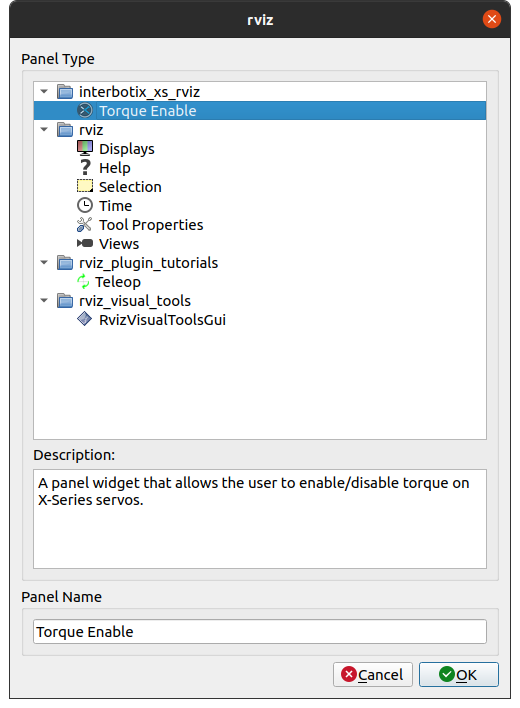
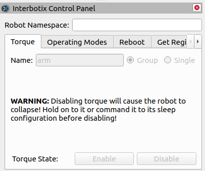
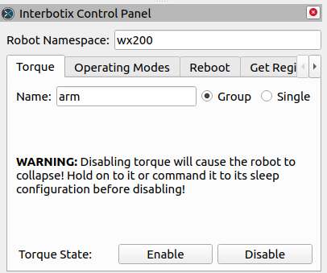

# interbotix_xs_rviz

## Overview

This package provides interfaces to interact with your X-Series robot through RViz panels, tools, and displays.

## Nodes

Each interface interacts with the X-Series robots using nodes. These are described below:
- **interbotix_control_panel** - allows the user to specify a namespace under which they can then call several services from the **xs_sdk** node including *reboot_motors*, *set_operating_mode*, *torque_enable*, and *set_motor_registers*; users can also kill the **xs_sdk** node in an emergency.

## Usage

This package is not meant to be used by itself, but rather with any X-Series robot through RViz. Simply start any package that launches RViz, add the display or panel, and use it as directed. The panel is included in the default rvizconfig pointing at by the *interbotix_xsarm_descriptions* package.

    

### Interbotix Control Panel

The Interbotix Control Panel presents a very simple interface that allows the user to call the services under any valid namespace. 

1. To add the panel to RViz, click **Panels > Add New Panel > interbotix_xs_rviz > Interbotix Control Panel**.
2. The panel will start with all input fields disabled.

    

3. Fill in the Robot Namespace field with the codename of your robot and the input fields will be enabled. Note that the namespace must be valid. For example, if the services are under the namespace `wx200`, you must enter `wx200` in the Robot Namespace field.

    

When disabling torque or pressing the E-Stop button, it is **very important** that you hold onto the arm before pressing the buttons, as arm will collapse.
