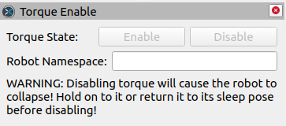
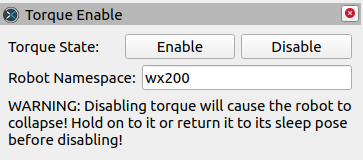

# interbotix_xs_rviz

## Overview

This package provides interfaces to interact with your X-Series robot through RViz panels, tools, and displays.

## Nodes

Each interface interacts with the X-Series robots using nodes. These are described below:
- **torque_enable_panel** - allows the user to specify a namespace under which they can then enable and disable torque using the torque_enable service from the **xs_sdk** node

## Usage

This package is not meant to be used by itself, but with any X-Series robot through RViz. Simply start any package that launches RViz, add the display or panel, and use it as directed.

    

### Torque Enable Panel

The Torque Enable panel presents a very simple interface that allows the user to call the *torque_enable* service under any valid namespace. 

1. To add the panel to RViz, click **Panels > Add New Panel > interbotix_xs_rviz > Torque Enable**.
2. The panel will start with the Enable and Disable buttons greyed out. 

    

3. Fill in the Robot Namespace field with the codename of your robot and the buttons will be enabled. Note that the namespace must be valid. For example, if the torque_enable service is under the namespace `wx200`, you must enter `wx200` in the Robot Namespace field.

    

4. When disabling torque, it is **very important** that you hold onto the arm before pressing the Disable button, as disabling torque to the servos will make the arm collapse.
